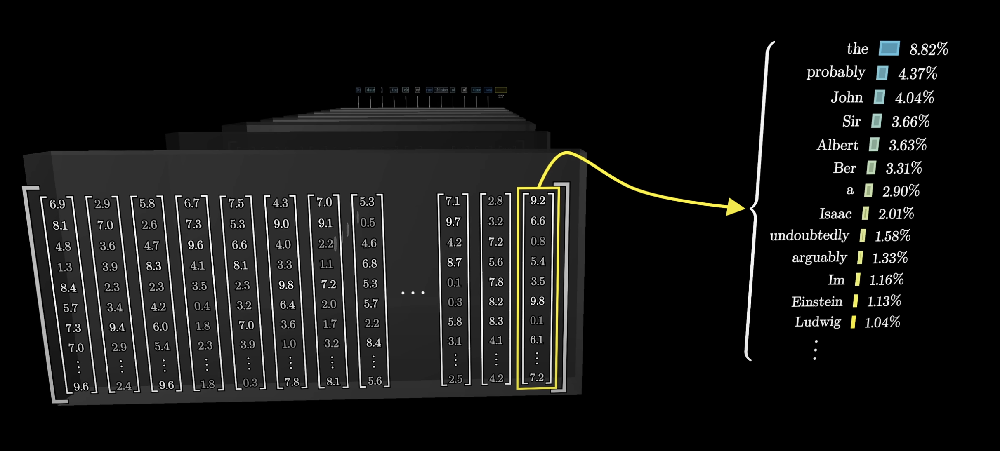
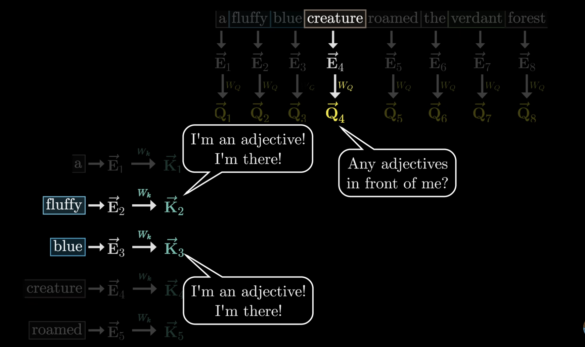
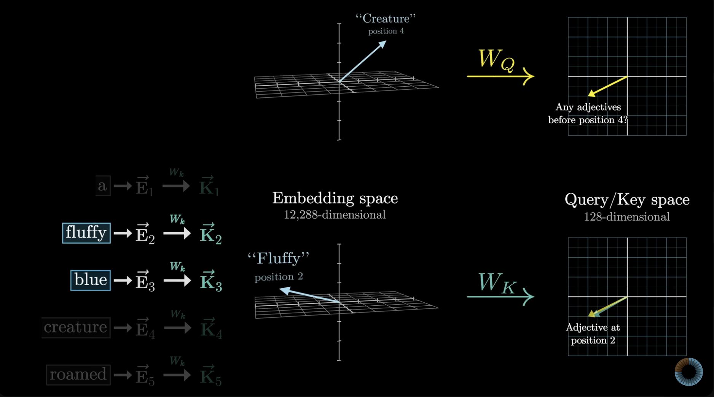
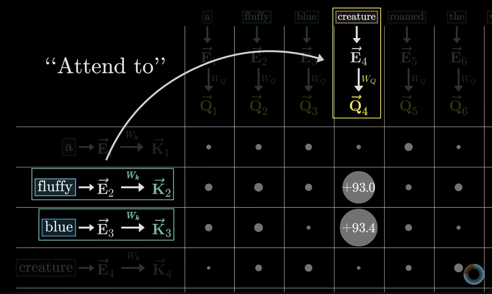
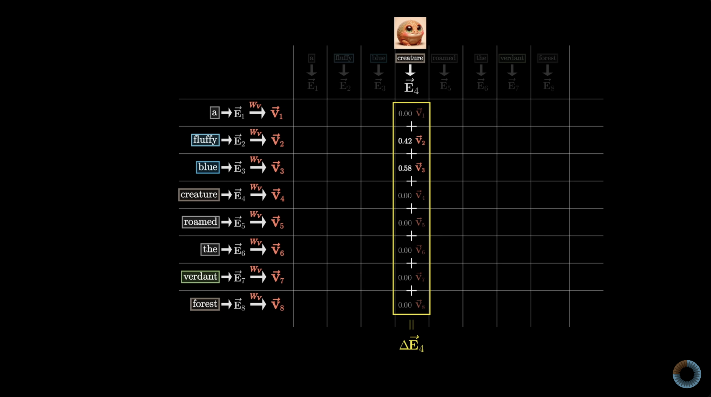
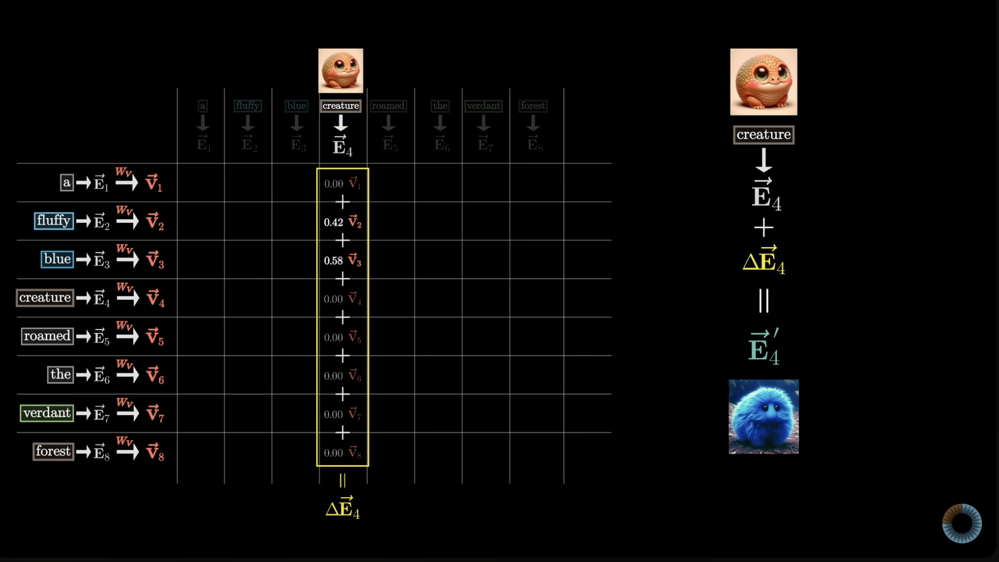

# Machine Learning from Scratch
Implementations of ML, using only numpy.

1. [Neural Networks](#neural-networks)
2. [Transformer](#transformer)


## Neural Networks

In the context of artificial neural networks:
- A neuron is a simple unit that holds a number.
- This number is called its "activation".

### What is a Neural Network?

- A neural network is made up of many neurons organized into layers.
- There are typically three types of layers:
  1. Input layer
  2. Hidden layer(s)
  3. Output layer


### What Does a Neural Network Do?

An artificial neural network is a statistical model that:
1. Learns patterns from training data
2. Applies these learned patterns to new, unseen data

## How Neural Networks Work

Now that we know what a neural network is, let's dive into how it operates.

### Connections Between Neurons

- Each neuron in one layer is connected to all neurons in the next layer.
- The strength of each connection is called its `"weight"`.
- During training, these weights are adjusted to identify patterns in the data.

### How a Neuron's Activation is Determined

The activation of a neuron is calculated based on:
1. The activations of all neurons in the **previous** layer
2. The weights of the connections to those neurons

Here's how it works:
1. Multiply each incoming activation by its corresponding weight
2. Sum up all these products
3. Add a special value called the `"bias"`

This can be represented by the formula:

```python
weighted_sum = w1*a1 + w2*a2 + ... + wn*an + bias
```

Where:
- `wi` is the weight of the connection from neuron `i` in the previous layer
- `ai` is the activation of neuron `i` in the previous layer
- bias is an extra adjustable value


### The Role of Bias

The bias serves an important function:
- It shifts the activation function
- This allows the neuron to adjust its sensitivity to inputs
- A positive bias makes the neuron more likely to activate
- A negative bias makes it less likely to activate


### Activation Functions

After calculating the weighted sum, we apply an "activation function". Common choices include:

1. Sigmoid function: Maps the output to a range between 0 and 1
2. ReLU (Rectified Linear Unit): Outputs the input if it's positive, otherwise outputs 0

In this guide, we'll focus on ReLU:

```python
def relu(self, x):
        return np.maximum(0, x)
```
ReLU is popular because it helps the network learn more effectively.

## Training the Neural Network

Now that we understand the basic structure and operation of a neural network, let's look at how it learns.

### Forward Propagation

This is the process of passing input through the network to get an output:

1. Start with the input layer
2. For each subsequent layer:
   a. Calculate the weighted sum for each neuron
   b. Apply the activation function
3. Repeat until we reach the output layer

### Measuring Performance: The Loss Function

To train our network, we need to measure how well it's doing. We do this with a loss function:

1. Compare the network's output to the desired output
2. Calculate the difference
3. Square this difference (to make all values positive)
4. Sum these squared differences for all output neurons

The result is called the "loss". **The smaller the loss, the better the network is performing.**

```python
def mse_loss(self, y, activations):    
        return np.mean((activations-y)**2)
```

### Gradient Descent and Backpropagation

To improve the network's performance, we need to adjust its weights and biases. We do this using two key concepts:

1. [Gradient Descent](#gradient-descent): A method for minimizing the loss
2. [Backpropagation](#backpropagation): An algorithm for calculating how to adjust each weight and bias

Here's how it works:

1. Calculate the gradient of the loss function
   - This tells us how changing each weight and bias affects the loss
2. Update weights and biases in the direction that reduces the loss
3. Repeat this process many times

### Gradient Descent

- Optimization algorithm to **minimize the cost function**.
- Uses gradients to update/adjust weights and biases in the direction that minimizes the cost.

- We look for the **negative** gradient of the cost function, which tells us how we need to change the weights and biases to most efficiently decrease the cost

*Backpropagation is the algorithm used to CALCULATE these gradients*


### Backpropagation

The algorithm for determining **how a SINGLE training example would like to nudge the weights and biases, not just if they should go up or down, but in terms of what relative proportions to those changes cause the most rapid decrease to the cost.**

- The magnitude of a gradient is how sensitive the cost function is to each weight and bias.
    - Ex. you have gradients [3.2, 0.1]. Nudging the weight with gradient 3.2 results in a cost 32x greater, than the cost when nudging (the same way) the weight with gradient 0.1


Activation is influenced in three ways:<br>
```python
w1*a1 + w2*a2 + ... + wn*an + bias
```
- Changing the bias
- Increasing a weight, in proportion to its activation (the larger the activation, the greater the change)
- Changing all activations in previous layer, in proportion to its weights (the larger the weight, the greater the change) (but don't have direct influence over activations themselves, just weights and biases)

"Propagate backwards": backpropagation is applied in the direction from the last layer to the first layer.
<br>------
<br>

**∂C/∂w = ∂C/∂a × ∂a/∂z × ∂z/∂w**

*where C is cost, w is weight, a is activation (output of neuron), z is the weighted sum (input to neuron, before activation).*

This tells us how much the cost (error) would change if we slightly adjusted a particular weight. 
- It indicates the direction to change the weight. If the derivative is positive, decreasing the weight will reduce the error, and vice versa.
- The magnitude tells us how sensitive the error is to changes in this weight. Larger magnitude = weight has bigger impact on error


Averaged nudges to each weight and bias is the negative gradient of the cost function.


## Putting It All Together

Training a neural network involves repeating these steps many times:

1. Forward propagation: Pass input through the network
2. Calculate the loss: Measure how far off the output is
3. Backpropagation: Calculate how to adjust weights and biases
4. Update weights and biases: Make small adjustments to improve performance

After many iterations, the network learns to recognize patterns in the training data and can apply this knowledge to new, unseen data.

## A Simple Python Implementation

Here's a basic implementation of a neural network (feed-forward, multilayer percepton) from scratch in Python:

### The Neuron class:

- Implements forward pass with ReLU activation
- Implements backward pass, applying the chain rule
- Updates weights and bias based on the calculated gradients


### The Layer class:

- Manages a collection of neurons
- Implements forward and backward passes for the entire layer


### The NeuralNetwork class:

- Manages multiple layers
- Implements forward pass through all layers
- Implements the training loop, including:

    - Forward pass
    - Loss calculation
    - Backward pass (backpropagation)
    - Updating of all weights and biases

```python
import numpy as np
import struct
import os
class Neuron:
    def __init__(self, num_inputs):
        self.weights = np.random.randn(num_inputs, 1) * 0.01
        self.bias = np.zeros((1, 1))
        self.last_input = None
        self.last_output = None

    def relu(self, z):
        return np.maximum(0, z)
    
    def relu_derivative(self, z):
        return np.where(z > 0, 1, 0)
    
    def forward(self, activations):
        self.last_input = activations
        z = np.dot(activations, self.weights) + self.bias
        self.last_output = self.relu(z)
        return self.last_output

    def backward(self, dC_da, learning_rate):
        da_dz = self.relu_derivative(self.last_output)
        dC_dz = dC_da * da_dz
        dC_dw = np.dot(self.last_input.T, dC_dz)
        dC_db = np.sum(dC_dz, axis=0, keepdims=True)

        self.weights -= learning_rate * dC_dw
        self.bias -= learning_rate * dC_db

        return np.dot(dC_dz, self.weights.T)


    # output_gradient: 
        # A positive gradient means we need to decrease that output
        # A negative gradient means we need to increase that output

    # learning_rate: how big of a step is taken while updating weights and biases


class Layer:
    def __init__(self, num_neurons, num_inputs_per_neuron):
        self.neurons = [Neuron(num_inputs_per_neuron) for _ in range(num_neurons)]

    def forward(self, activations):
        return np.hstack([neuron.forward(activations) for neuron in self.neurons])
    
    def backward(self, output_gradient, learning_rate):
        return np.sum([neuron.backward(output_gradient[:, [i]], learning_rate) for i, neuron in enumerate(self.neurons)], axis=0)

class NeuralNetwork:
    def __init__(self, layer_sizes):
        self.layers = []
        for i in range(len(layer_sizes) - 1):
            self.layers.append(Layer(layer_sizes[i+1], layer_sizes[i]))

    def forward(self, activations):
        for layer in self.layers:
            activations = layer.forward(activations)
        return activations
    
    def mse_loss(self, y, activations):    
        return np.mean((activations-y)**2)
    
    def derivative_mse_loss(self, y, activations):
        return 2*(activations-y) / y.shape[0]
    
    def train(self, X, y, epochs, learning_rate, batch_size=32):
        for epoch in range(epochs):
            total_loss = 0
            for i in range(0, len(X), batch_size):
                X_batch = X[i:i+batch_size]
                y_batch = y[i:i+batch_size]
                
                outputs = self.forward(X_batch)
                loss = self.mse_loss(y_batch, outputs)
                total_loss += loss * len(X_batch)

                output_gradient = self.derivative_mse_loss(y_batch, outputs)
                for layer in reversed(self.layers):
                    output_gradient = layer.backward(output_gradient, learning_rate)

            avg_loss = total_loss / len(X)
            print(f"Epoch {epoch+1}/{epochs}, Loss: {avg_loss}")

    def predict(self, X):
        return self.forward(X)
```


If you'd like a video format version, see the video below:

[](https://www.youtube.com/watch?v=oVVJbWgZySY&t)

# Transformer

## Overview

## Input
A collection of real numbers, which could be:
- A simple list, a 2D matrix, or even a higher-dimensional tensor
- This collection is progressively transformed through multiple layers, with each layer being an array of real numbers. The transformation continues until the final output layer is reached
    - Ex. in a text-processing model like GPT, the final layer generates a list of numbers representing the probability distribution of all possible next words

## Output:
A probability distribution over all potential next tokens



## Tokens

Tokens are "little pieces" of information (ex. words, combinations of words, sounds, images)

- Every token is associated with a vector (some list of numbers)
  - encodes the meaning of that piece
  - ex. in considering these vectors as coordinates, words with similar meanings tend to land near each other


## Embeddings

Words that are used and occur in the same context tend to purport similar meanings (distributional semantics)

- Break up the input into little chunks, then into vectors. These chunks are called tokens
- The model has predefined vocabulary (list of all possible words)
- Embedding matrix (W_E): single column for each word
- The dimensions of the embedding space can be very high (ex. 12,288)
- theoretically, E(man) - E(woman) ~= E(king) - E(queen)
- the dot product of two vectors, is a measure of how well they align. In this case, this acts as a measure of similarity between words

See `embedding_notes.ipynb` for more on embeddings!

Below is an image of the embedding matrix. Each word corresponds to a specific vector, with no reference to its context.
It is the Attention block's responsibility to update a word's vector with its context. (to be discussed later)


## Positional Encoders

Positional encoding provides info about the order of tokens in a sequence.

- ex. Where a specific word is positioned in a sentence.
- A fixed positional encoding vector is added to each word's embedding.

*NOTE: word embeddings & positional embeddings are separate. Word embeddings capture SEMANTIC MEANING, while positional encodings capture the ORDER of tokens*

## Unembedding

In determining desired output of the transformer (a probability distribution of all possible tokens that can come next in the generating text), a well trained network on the particular dataset is able to determine the next best possible token by:

1. Using a matrix (embedding matrix W_u) that maps the last vector/embedding in the context to a list of 50k values (one for each token in the vocabulary)
2. Function that normalizes this into a probability distribution (softmax)

## Softmax (normalization)

The desired output of a transformer is a probability distribution of all possible tokens that can come next in the generating text

A probability distribution is defined as a sequence of numbers between 0-1, and that sums to 1. Softmax can give any sequence of numbers these criteria

```python
import numpy as np

# given a sequence of numbers, each term `i`

# softmax eqn:      e^i/(sum of e^i for all terms)     

# probability distribution: 
    # 1) all numbers are positive numbers 0-1  (e^i)  
    # sum of all numbers = 1 (sum of e^i of all terms)

seq = [2, 4, 5]
print(np.exp(seq)/np.sum(np.exp(seq)))
# [0.03511903 0.25949646 0.70538451]
```


## Temperature

With softmax, the constant T added to the denominator of the exponents of e in the equation can cause more creative generated text

- Makes the softmax outputs LESS extreme towards 0 and 1
- This enables more unique text to be generated and different for each generation


## Attention

Goal: enable the model to focus on different parts of the input sequence when producing an output for a specific token

### Attention Score

A value that represents how much focus (or attention) one word should give to another word in the sequence

(Its derivation is explained later)

### Attention Block

Updates a word's embedding vector in reference to its context. Enables the transfer of information from one embedding to another

Prior to Attention, the embedding vector of each word is consistent, regardless of its context (embedding matrix). Therefore, the motivation of Attention is to update a word's embedding vector depending on its context (i.e. surrounding tokens) to capture this specific contextual instance of the word


The computation to predict the next token relies entirely on the final vector of the current sequence

Initially, this vector corresponds to the embedding of the last word in the sequence. As the sequence passes through the model's attention blocks, the final vector is updated to include information from the entire sequence, not just the last word. This updated vector becomes a summary of the whole sequence, encoding all the important information needed to predict the next word


### Single-Head Attention

Goal: series of computations to produce a new refined set of embeddings

ex. Have nouns ingest the meanings of their corresponding adjectives


#### Query

Query: represents the "question"/"focus" that the single-head attention is asking about the current word
ex. if the current word is "cat" in the sentence "The cat sat on the mat", the Query for "cat" might be asking, "Which other words (Keys) in this sentence should I focus on to understand cat better?"

#### Key

Key: serves as a criterion/reference point against which the Query is compared to determine the relevance of each word
- helps the model understand which other words are related/important to the current word by evaluating how similar/relevant they are to the Query
- ex. in the sentence "The cat sat on the mat", the Key for "sat" might contain info that represents the action/verb aspect of the sentence.
- the Query for "cat" might compare itself to this Key to determine that "sat" is relevant to understanding the action associated with "cat"

#### Attention Score

Attention Score: tells us how relevant each word is
- i.e. value that represents how much focus/attention one word (Query) should give to another word in the sequence (Key)
- computed by comparing the Query vector of the current word with the Key vectors of all other words (including itself) in the sequence
- score indicates relevance/importance to each word in the current word

calculated as: the dot product between the Query and Key vectors
- higher dot product: Key is more "relevant" to Query
- This means the model gives more weight to the Value vector of that word when forming the final representation of the Query word
- ex. in the sentence "The cat sat on the mat," the word "cat" would have a higher influence on the final understanding of "sat" if the model finds "cat" relevant to "sat" based on their Query-Key relationship

Input: Query, Key and Value matrices

Output: matrix where each vector is the weighted sum of the Value vectors, where the weights come from the attention scores (which are based on the dot product of the Query and Key matrices)

Steps:

1. Create weight matrices (initialized randomly initially. same dimensions as embeddings)
2. Get Query, Key values from embed.py (i.e. linear transformation applied to the vectors of the (word embeddings & positional encoding) with weight matrices, for each token)
3. Calculate the attention score (dot product of the Query and Key matrices)
4. Apply masking to the attention scores
5. Apply softmax to the (masked) attention scores (this is called normalization)
6. Use attention scores to weight the Value vectors
7. Output step 6.





The higher the dot product, the more relevant the Query to the Key (i.e. word to another word in the sentence)





### Masking

Masking is to prevent later tokens influencing earlier ones during the training process. This is done by setting the entries of the older tokens to -infinity. So when softmax is applied, they are turned to 0.


Why mask?
- During the train process, every possible subsequence is trained/predicted on for efficiency.
- One training example, effectively acts as many.
- This means we never want to allow later words to influence earlier words (because they essentially "give away" the answer for what comes next/the answer to the predictions)


### Softmax

After masking, softmax (normalization) is applied. Masking was done to ensure that later tokens do not affect earlier tokens in the training process. So, the older tokens' entries are set to -infinity during the masking phase, to be transformed into 0 with softmax.


### Value

Value matrix W_v is multiplied by the embedding of a word, and this is added to the embedding of the next word

Values essentially answer: IF a word is relevant to adjusting the meaning of something, what exactly should be added to the embedding of that something else, in order to reflect this?

Value: vector that holds the actual info that will be passed along the next layer of the network if a word is deemed relevant based on the attention scores
- after computing the attention scores, these scores are used to weigh the Values
- the weighted sum of these Values is then used as the output for the current word
- continuing with the sentence "The cat sat on the mat", if "sat" (Key) is deemed important for "cat" (Query), the Value associated with "sat" will contribute significantly to the final representation of "cat"
- this helps the model understand that "cat" is related to the action of "sitting"






## Multi-Head Attention

An Attention block is made up of many Attention heads running in parallel (multi-headed attention)

By running many distinct heads in parallel, we are giving the model the capacity to learn many distinct ways that context changes meaning

In other words, multiple instances of Self Attention class running in parallel, each instance with different weight matrices

Steps:

1. Declare multiple heads/instances of Self Attention running in parallel
2. Each head/instance of Self Attention class focuses on different parts of the input by having its own set of weight matrices (W_q, W_k, W_v)
3. Each heads/instances of Self Attention's output is concatenated along the embedding dimension (input of each Self Attention class)
4. Concatenated output is passed through a final linear transformation (a weight matrix)
   - To combine the information from all heads into a single output

### Why Concatenate and Apply a Final Linear Transformation?

The reason for concatenating the outputs from all heads is that each head has learned something different about the input. By concatenating, we combine these insights into a single, unified representation

The final linear transformation is applied to this concatenated output to bring it back to the original embedding dimension

a. Concatenation
In multi-head attention, each head learns different aspects of the input because each head operates on a different part of the embedding (head_dim). By concatenating the outputs from all the heads, we are combining these different learned representations into a single vector that encapsulates all these different insights

b. Final linear transformation
The final linear transformation, done using a weight matrix, mixes the information from the different heads back into a single vector of the original embedding_dim. This step is crucial because it allows the model to create a unified representation that integrates the different perspectives learned by each head

*Credit to 3blue1brown for the visuals!*
